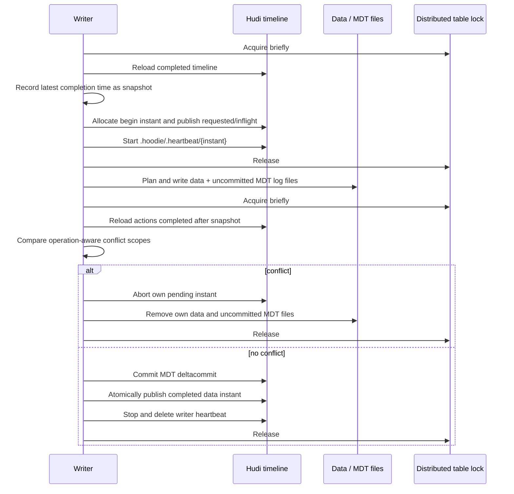
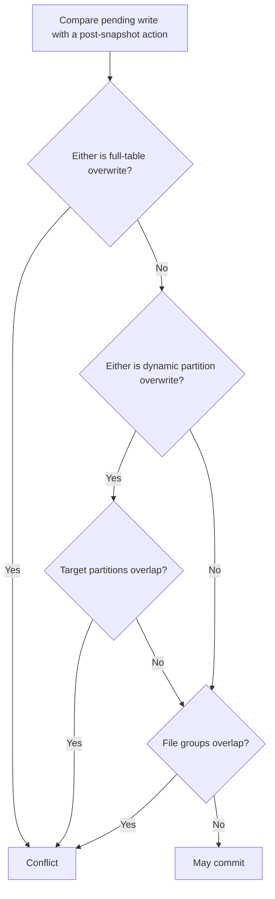

<!--
  ~ Licensed to the Apache Software Foundation (ASF) under one
  ~ or more contributor license agreements.  See the NOTICE file
  ~ distributed with this work for additional information
  ~ regarding copyright ownership.  The ASF licenses this file
  ~ to you under the Apache License, Version 2.0 (the
  ~ "License"); you may not use this file except in compliance
  ~ with the License.  You may obtain a copy of the License at
  ~
  ~   http://www.apache.org/licenses/LICENSE-2.0
  ~
  ~ Unless required by applicable law or agreed to in writing,
  ~ software distributed under the License is distributed on an
  ~ "AS IS" BASIS, WITHOUT WARRANTIES OR CONDITIONS OF ANY
  ~ KIND, either express or implied.  See the License for the
  ~ specific language governing permissions and limitations
  ~ under the License.
  -->

# Concurrent Writers and Optimistic Concurrency Control

This document describes hudi-rs's multi-writer protocol. It follows Apache
Hudi RFC-22 and the table-version 9 technical specification for optimistic
concurrency control (OCC), and RFC-91 for storage-based distributed locking.

## Guarantees and scope

OCC provides snapshot isolation for independent writers to the same table:

- writers plan and produce data files against a stable committed snapshot;
- non-overlapping file-group writes may complete concurrently;
- when writers mutate the same `(partition path, file ID)`, the first one to
  complete wins and the later commit fails with a write-conflict error;
- deletes participate at file-group scope, so a delete can run alongside a
  write to a different group but conflicts with an upsert or delete of the
  same group;
- a full-table overwrite conflicts with every data action that completed after
  its snapshot, including appends that created previously unknown groups;
- a dynamic partition overwrite conflicts with every post-snapshot write in a
  target partition, but remains concurrent with writes to other partitions;
- readers continue to see only completed timeline instants;
- the data timeline and metadata table are published together inside the
  commit critical section.

The first implementation covers data `commit`, `deltacommit`, and
`replacecommit` actions produced by append, upsert, update, delete, table
overwrite, and dynamic partition overwrite. It also detects completed Apache
Hudi/Spark actions by parsing their standard commit metadata. Native drivers
for compaction, clustering, cleaning, or indexing are separate work.

Marker-based early conflict detection from RFC-56 is an optimization and is
not required for correctness. hudi-rs detects conflicts immediately before
commit, after the data work has completed.

## Protocol



The snapshot boundary is a completion time on timeline layout v2. This is
important because begin-time and completion-time order can differ under
multiple writers. Layout v1 has no completion time and falls back to requested
instant ordering.

The base conflict key is `(partition path, file ID)`, matching Apache Hudi's
`SimpleConcurrentFileWritesConflictResolutionStrategy`. A replace commit's
write stats and `partitionToReplaceFileIds` both contribute to its write set.
hudi-rs additionally widens the scope for overwrite intent. Without that
widening, an append that creates a new group after the overwrite snapshot is
absent from `partitionToReplaceFileIds` and could incorrectly survive a
supposed full replacement.

| Operation | Conflict scope |
|---|---|
| append/insert | Exact `(partition, file ID)` |
| upsert/update | Exact `(partition, file ID)` |
| delete | Exact `(partition, file ID)` |
| dynamic partition overwrite (`INSERT_OVERWRITE`) | Every write in each target partition |
| full-table overwrite (`INSERT_OVERWRITE_TABLE`) | Every concurrent data write in the table |



New file groups use random UUID file IDs; therefore two pure inserts normally
do not conflict. Like Apache Hudi's default strategy, key-level insert/insert
conflict detection is not performed.

## Lock providers

### In-process

`InProcessLockProvider` remains the default for `single_writer`. It coordinates
table handles in one process only and must not be used for independent
processes or hosts.

### Storage-based

`StorageBasedLockProvider` stores one JSON lease at
`.hoodie/.locks/table_lock.json`:

```json
{"expired":false,"validUntil":1770000000000,"owner":"<uuid>"}
```

Acquisition creates the object only if absent, or conditionally replaces an
expired lease using its object-store ETag/version. Release marks the lease
expired with the same conditional update; it is not deleted because cloud
stores do not generally support conditional delete. Losing the ETag/version
means losing the lock.

The provider uses `object_store` conditional puts, so it works with backends
that implement create-if-absent and compare-and-swap semantics, including AWS
S3, Google Cloud Storage, and Azure Blob Storage. The local filesystem backend
does not implement conditional updates. The current lock providers therefore
do not support local multi-process OCC; that deployment needs another
distributed lock provider. Tests can use the in-memory object store.

## Configuration

```text
hoodie.write.concurrency.mode=optimistic_concurrency_control
hoodie.write.lock.provider=org.apache.hudi.client.transaction.lock.StorageBasedLockProvider
hoodie.cleaner.policy.failed.writes=LAZY
```

Supported lock tuning keys retain Apache Hudi's names and defaults:

| Configuration | Default | Meaning |
|---|---:|---|
| `hoodie.write.lock.wait_time_ms` | `60000` | Overall lock acquisition timeout |
| `hoodie.write.lock.wait_time_ms_between_retry` | `1000` | Delay between acquisition attempts |
| `hoodie.write.lock.storage.validity.timeout.secs` | `300` | Lease lifetime |
| `hoodie.write.lock.storage.renew.interval.secs` | `30` | Delay between CAS lease renewals |
| `hoodie.client.heartbeat.interval_in_ms` | `60000` | Pending-write heartbeat interval (minimum 1000 ms) |
| `hoodie.client.heartbeat.tolerable.misses` | `10` | Misses tolerated before LAZY rollback eligibility |

While a lease is held, a lock heartbeat conditionally extends `validUntil` using
the object version it read. A version conflict permanently marks the lease as
lost. Heartbeat and release share an internal gate, so a late renewal cannot
resurrect a lease after release. Configuration requires the lease lifetime to
be at least ten times the renewal interval, matching RFC-91 and Apache Hudi.

Each acquisition receives a new owner UUID, including repeated acquisitions
from the same provider instance. Validation performs a synchronous CAS renewal
immediately before timeline publication, giving the following mutation the
full configured lease window.

OCC requires `LAZY` failed-write cleaning. One writer must never eagerly roll
back another writer merely because its instant is requested or inflight. A
standard empty heartbeat object is overwritten for the complete pending
lifetime. A writer that detects a conflict rolls back only its own instant;
abandoned instants remain invisible until the heartbeat age exceeds interval ×
tolerable misses, when the next locked Rust writer (or Java cleaner) can roll
them back.

## Failure model

- A process that dies before completing leaves marker-listed, uncommitted
  files. Readers ignore them because no completed data instant exists.
- A lease expires after its owner dies. Another writer can take it only with a
  conditional update against the exact object version it read.
- A writer synchronously renews and verifies its lease immediately before publishing.
  If ownership was lost, it aborts without completing the timeline instant.
- RFC-91's object lock and the timeline object are two independent conditional
  writes; no object store can make them one atomic transaction. A process pause
  after lease validation but before the timeline PUT is therefore the residual
  fencing window. The 10× lease/renewal rule and pre-publication renewal bound
  that window. Deployments requiring strict server-side fencing across an
  arbitrary process pause need a lock service that validates a fencing token
  as part of the timeline mutation.
- A create-only timeline PUT that returns an error is reconciled by reading the
  exact path. Identical stored bytes count as success; unresolved outcomes
  preserve data for heartbeat-aware recovery rather than deleting possibly
  committed files.
- An MDT deltacommit is written before the data commit. Existing timeline
  fencing keeps an orphan MDT instant invisible if the process fails between
  the two publications.
- Timeline archival cannot hide conflict candidates: the OCC scan includes
  active completed instants and layout-v2 LSM history records newer than the
  transaction snapshot.
- Pending clustering, compaction, and log-compaction plans are rejected before
  planning because their conflict semantics are not yet implemented natively.

## References

- [RFC-22: Snapshot Isolation using OCC for multi-writers](https://cwiki.apache.org/confluence/spaces/HUDI/pages/170266055/RFC+-+22+Snapshot+Isolation+using+Optimistic+Concurrency+Control+for+multi-writers)
- [RFC-91: Storage-based lock provider using conditional writes](https://github.com/apache/hudi/blob/master/rfc/rfc-91/rfc-91.md)
- [RFC-56: Early Conflict Detection for Multi-writer](https://github.com/apache/hudi/blob/master/rfc/rfc-56/rfc-56.md)
- [Apache Hudi technical specification](https://hudi.apache.org/learn/tech-specs/)
